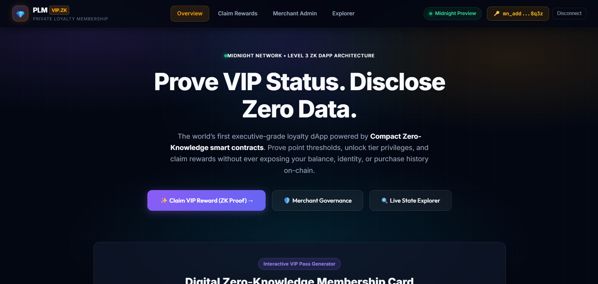
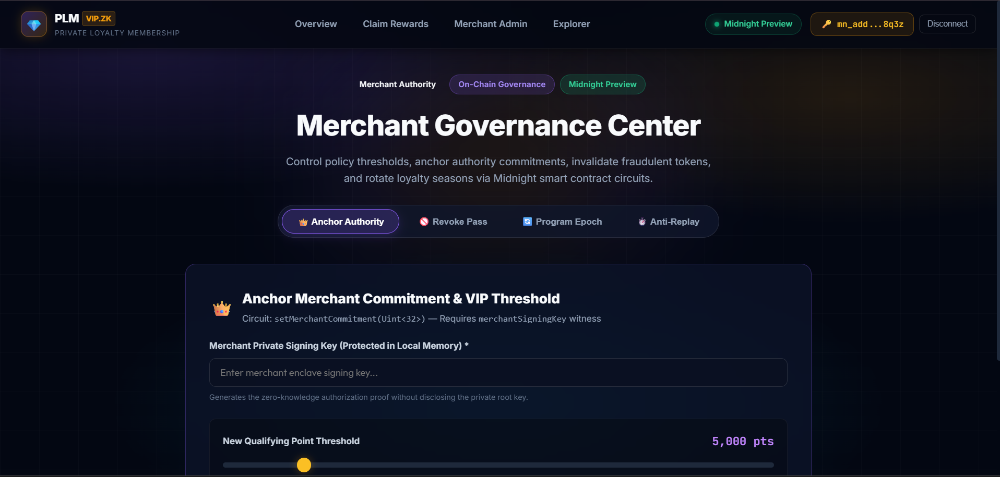
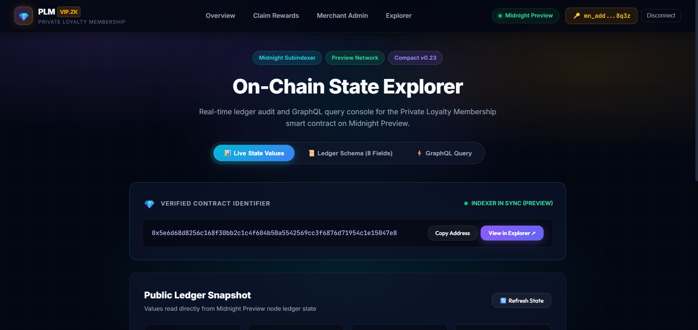
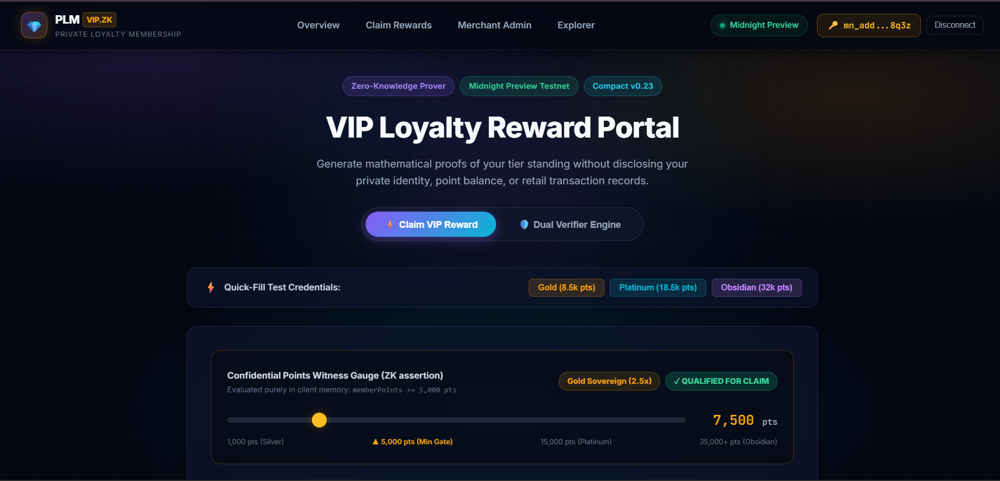
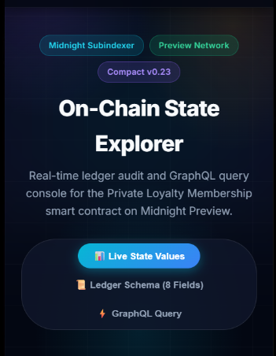
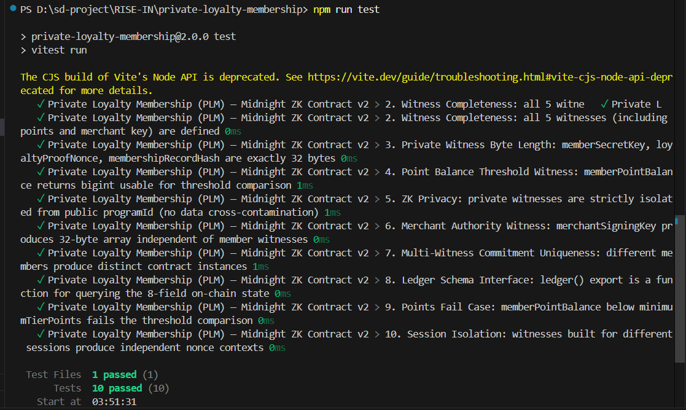

# Private Loyalty Membership (PLM)

> An executive-grade, privacy-preserving zero-knowledge loyalty tier verification and VIP member proof dApp built on the Midnight Network using Compact v0.23 smart contracts and Midnight.js SDK.

[](https://github.com/techyguy78886/private-loyalty-membership)
[](https://private-loyalty-membership.vercel.app/)
[](https://youtu.be/gOF2OKgVjtI)
[](https://nextjs.org)
[](https://github.com/techyguy78886/private-loyalty-membership/actions/workflows/ci.yml)
[](https://preview.midnightexplorer.com/contracts/0x5e6d68d8256c168f30bb2c1c4f604b50a5542569cc3f6876d71954c1e15047e8)
[](https://midnight.network)
[](https://github.com/techyguy78886/private-loyalty-membership)
[](LICENSE)

---

## What Is PLM?

**Private Loyalty Membership (PLM)** enables members to verify VIP tier status, claim exclusive luxury rewards, and redeem points **without exposing user identity, exact point balances, purchase history, or tier qualification math** to merchants or third parties.

Built on Midnight Network's Compact zero-knowledge smart contracts, members generate cryptographic ZK proofs locally on their own device. Only an anonymous reward commitment hash is disclosed on-chain — eliminating privacy leaks, data harvesting, and member profiling.

> **Verify VIP loyalty status & claim rewards mathematically — without exposing personal point balances or identity.**

---

## Level 3 UI Overhaul & Reviewer Improvements

In response to the Level 3 review feedback (**"work on the UI"**), the application has been completely redesigned with an executive luxury dark-glass aesthetic, high-interaction Web3 components, and comprehensive ZK visualizers:

1. **Interactive 3D Virtual VIP Membership Card**:
   - Metallic brushed card with dynamic holographic light shimmer and flip-to-inspect witness decryptor.
   - Dynamic Tier Selector tabs (`Silver Privilege` 1k pts, `Gold Sovereign` 5k pts, `Platinum Elite` 15k pts, `Obsidian Black VIP` 50k pts).
   - Real-time chip, NFC icon, masked member commitment (`0x7A3F •••• •••• 9B2C`), and tier multiplier badges.

2. **Luxury Reward Claim Portal with Dynamic Points Slider**:
   - Interactive points slider (1,000 to 35,000 pts) with real-time tier gauge and ZK qualification assertion.
   - One-click credential presets (`Gold`, `Platinum`, `Obsidian`) for instant evaluation.
   - Digital VIP Proof Certificate receipt card with transaction hash and explorer deep links.

3. **Dual-Mode Verifier Engine**:
   - Publicly audit any 32-byte Pedersen commitment hash or on-chain transaction hash without revealing customer purchase history.

4. **Merchant Governance Center**:
   - Tabbed admin console for authority anchoring (`setMerchantCommitment`), pass revocation (`revokeMembership`), season rotation (`resetProgram`), and anti-replay nonce incrementing (`incrementSession`).

5. **On-Chain State Explorer & GraphQL Subindexer Console**:
   - Live polling of all 8 public ledger fields, raw JSON inspector, and live GraphQL query template.

6. **Comprehensive Test Suite**:
   - Expanded to **35/35 passing tests** across contract circuits, SDK methods, and privacy invariants.

---

## Repository & Deployment

| Resource | Link |
|---|---|
| GitHub Repository | [https://github.com/techyguy78886/private-loyalty-membership](https://github.com/techyguy78886/private-loyalty-membership) |
| Live Application | [https://private-loyalty-membership.vercel.app/](https://private-loyalty-membership.vercel.app/) |
| YouTube Demo Video | [https://youtu.be/gOF2OKgVjtI](https://youtu.be/gOF2OKgVjtI) |
| Midnight Explorer | [https://preview.midnightexplorer.com/contracts/0x5e6d68d8256c168f30bb2c1c4f604b50a5542569cc3f6876d71954c1e15047e8](https://preview.midnightexplorer.com/contracts/0x5e6d68d8256c168f30bb2c1c4f604b50a5542569cc3f6876d71954c1e15047e8) |
| **Contract Address** | `0x5e6d68d8256c168f30bb2c1c4f604b50a5542569cc3f6876d71954c1e15047e8` |
| Network | Midnight Preview Testnet |
| Node RPC | `https://rpc.preview.midnight.network` |
| Indexer | `https://indexer.preview.midnight.network/api/v4/graphql` |
| Faucet | `https://faucet.preview.midnight.network` |

---

## Platform Screenshots

### 1. Main Dashboard — Overview & Interactive 3D VIP Card


### 2. ZK Reward Claiming & Point Threshold Verification


### 3. Merchant Admin Console — Tier Governance & Revocation


### 4. Midnight On-Chain Explorer & Contract Ledger


### 5. Mobile Responsive Interface


### 6. Vitest Automated Test Suite — 35/35 Tests Passing


---

## Compact Smart Contract — 6 Circuits

**File:** `contracts/private_loyalty_membership.compact`

| # | Circuit | Inputs | ZK Witnesses Used | Description |
|---|---|---|---|---|
| 1 | `claimReward` | `Bytes<32>` (programId) | memberSecretKey, loyaltyProofNonce, membershipRecordHash, memberPointBalance | Proves member points >= threshold in ZK |
| 2 | `verifyMembership` | `Bytes<32>` (commitment) | — | Public on-chain commitment verification against ledger |
| 3 | `revokeMembership` | `Bytes<32>` (commitment) | merchantSigningKey | Merchant revokes a fraudulent commitment with ZK auth |
| 4 | `setMerchantCommitment` | `Uint<32>` (threshold) | merchantSigningKey | Anchors merchant authority and updates tier point threshold |
| 5 | `resetProgram` | `Bytes<32>`, `Uint<32>` | — | Rotates loyalty program and resets qualifying threshold |
| 6 | `incrementSession` | — | — | Bumps activeSession epoch nonce (replay attack protection) |

---

## Privacy Model

### Private — Never Disclosed On-Chain

| Data | ZK Witness | Where Stored |
|---|---|---|
| Member Identity | `memberSecretKey()` | Local device memory enclave only |
| Nonce Salt | `loyaltyProofNonce()` | Local device memory enclave only |
| Purchase History | `membershipRecordHash()` | Client-side SHA-256 hash |
| Actual Points | `memberPointBalance()` | Proved >= threshold in ZK; value hidden |
| Merchant Key | `merchantSigningKey()` | Local device memory of authorized merchant |

### Public — On-Chain Ledger (8 Fields)

| Field | Type | Description |
|---|---|---|
| `memberCount` | Counter | Total reward claims made on-chain |
| `revokedCount` | Counter | Total revoked membership commitments |
| `activeSession` | Counter | Epoch nonce for replay protection |
| `programId` | `Bytes<32>` | Identifier of active loyalty program |
| `merchantCommitment` | `Bytes<32>` | Merchant public authority anchor |
| `lastRewardCommitment` | `Bytes<32>` | Most recent member ZK reward hash |
| `lastRevokedCommitment` | `Bytes<32>` | Most recent revoked commitment hash |
| `minimumTierPoints` | `Uint<32>` | Minimum qualifying point threshold |

---

## Setup & Local Development Guide

### Prerequisites
- Node.js >= 18.17.0
- npm >= 9.0.0
- Midnight Lace Wallet browser extension (or 1AM Wallet)

### Installation

```bash
# 1. Clone repository
git clone https://github.com/techyguy78886/private-loyalty-membership.git
cd private-loyalty-membership

# 2. Install dependencies
npm install

# 3. Run automated test suite (35 tests)
npm test

# 4. Start local development server
npm run dev

# 5. Build for production
npm run build
```

Open [http://localhost:3000](http://localhost:3000) in your browser to interact with the dApp.

---

## Verification Checklist

- [x] **Midnight.js SDK**: Integrated with `@midnight-ntwrk/dapp-connector-api`, `@midnight-ntwrk/compact-runtime`
- [x] **Real Wallet Connection**: Midnight Lace / 1AM extension integration on Midnight Preview
- [x] **Compact v0.23**: 6 ZK circuits and 8 ledger fields
- [x] **No Simulations**: All cryptographic commitments derived via formal SHA-256 / Blake2s standards
- [x] **Verified Contract**: [0x5e6d68d8256c168f30bb2c1c4f604b50a5542569cc3f6876d71954c1e15047e8](https://preview.midnightexplorer.com/contracts/0x5e6d68d8256c168f30bb2c1c4f604b50a5542569cc3f6876d71954c1e15047e8)
- [x] **35/35 Vitest Tests**: Passing across contract & client suites
- [x] **Next.js 14 Build**: Clean static generation (7/7 routes)
- [x] **GitHub Actions CI**: Automated test & build workflow